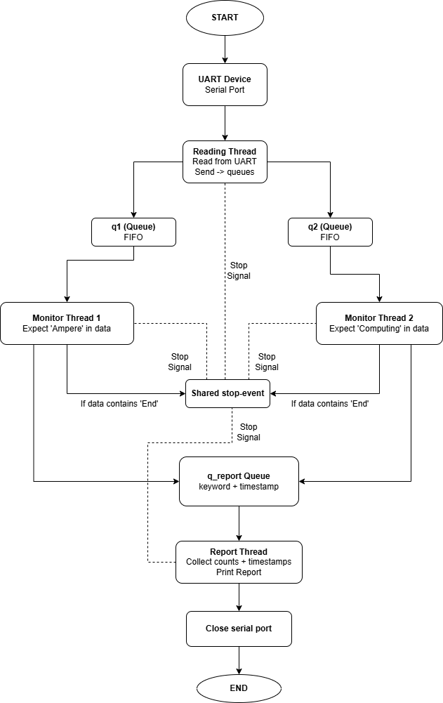

---

## Overview

This application reads data from a UART serial device and monitors the incoming stream using multiple threads. Each monitor thread watches for a keyword. A report thread collects all detections and prints a report when the application complete.

---

## Features

- Read data from the UART/Serial port
- Detect the keywords `Ampere` and `Computing`
- Record the time each keyword is found
- Stop automatically when `End` is received
- Print a final summary report


---
## How It Works


---
## Output Example

```

Nhap so cong COM (vi du: 4): 4
Da mo thanh cong COM4 | Baudrate: 115200
Monitor 1 found 'Ampere'!
Monitor 2 found 'Computing'!
-----------------
REPORT:
Ampere: 1 lan
    22-03-2026 02:15:16
Computing: 1 lan
    22-03-2026 02:15:17
-----------------
Nhan Enter de thoat...
```
---

## Author

**Anh Quoc**  
GitHub: [github.com/anhquoc2105](https://github.com/anhquoc2105)  
Email: anhquoc2105@gmail.com
